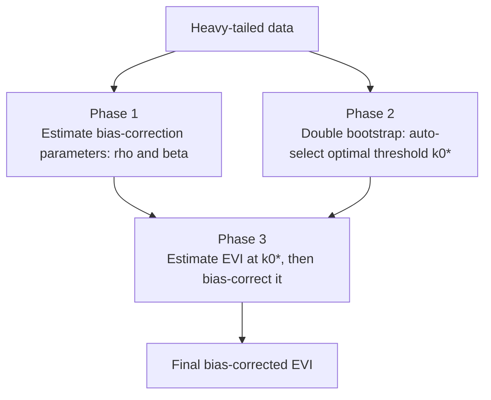

# Adaptive Extreme Value Index Estimation


> A from-scratch Python implementation of a published research method that answers a hard question automatically: **"how extreme can the extremes get?"** — without the subjective guesswork the classic methods require.

This project translates a dense academic paper into clean, usable code. The README is written so that **anyone** can follow it — no background in statistics needed. It builds from the real-world problem, to the intuition, to the algorithm, to the code.

---

## Table of Contents

1. [TL;DR](#tldr)
2. [What Problem Does This Solve?](#1-what-problem-does-this-solve)
3. [The Catch: One Subjective Choice Ruins Everything](#2-the-catch-one-subjective-choice-ruins-everything)
4. [The Idea: Let the Data Choose](#3-the-idea-let-the-data-choose)
5. [How It Works: A Guided Tour](#4-how-it-works-a-guided-tour)
6. [A Little Theory (for the Curious)](#5-a-little-theory-for-the-curious)
7. [Repository Structure](#6-repository-structure)
8. [Installation](#7-installation)
9. [Usage](#8-usage)
10. [Where This Is Useful](#9-where-this-is-useful)
11. [References](#references)
12. [License](#license)

---

## TL;DR

Some events are rare but catastrophic: hundred-year floods, market crashes, enormous insurance claims. To plan for them, analysts estimate a single number — the **Extreme Value Index (EVI)** — that describes how "heavy" the tail of a distribution is (how likely and how severe the worst cases are).

Estimating the EVI traditionally requires a human to **eyeball a threshold** — how many of the largest observations to treat as "extreme." That choice is subjective and dramatically changes the answer.

This repository implements a **published, data-driven method** that selects that threshold automatically and then corrects the leftover statistical bias — turning a fiddly manual process into a single function call.

```python
evi = AdaptiveEVI(data, estimator="hill").generate_evi()
```

---

## 1. What Problem Does This Solve?

Most statistics care about the *average* case. **Extreme value theory** cares about the *worst* case — the tail of the distribution, where rare but high-impact events live.

The key quantity is the **Extreme Value Index (EVI)**: one number that summarizes how heavy that tail is.

- A **low EVI** means the tail is light — extreme outliers are unlikely and bounded.
- A **high EVI** means the tail is heavy — catastrophic outliers are both more likely and more severe.

Getting this number right has real stakes:

- **Insurance** prices catastrophe coverage (floods, storms) on it.
- **Engineering** sizes dams, bridges, and flood defenses to survive once-in-N-year events.
- **Finance** uses it for tail-risk and Value-at-Risk estimates.
- **Climate science** uses it to characterize extreme-weather frequency.

In short: the EVI is how you put a number on *"how bad can it get?"*

---

## 2. The Catch: One Subjective Choice Ruins Everything

To estimate the tail, you only use the **largest** observations — the ones that actually represent extremes. But how many is "the largest"? That count is the **threshold**, written **k**.

This single choice is the whole ballgame:

- Pick **too few** points (very small k), and your estimate is built on almost no data — it's noisy and unstable.
- Pick **too many** points (large k), and you start including ordinary, non-extreme values that **bias** the estimate.

Classic estimators (the **Hill** estimator, the standard **PWM** estimator) leave this choice to the analyst, who typically squints at a "Hill plot" looking for a flat region to read off a value.

> **Analogy.** It's like estimating how strong the strongest people on Earth are, but first having to decide by hand where "very strong" ends and "ordinary" begins. Draw the line in the wrong place and your conclusion is wrong — and two analysts will draw it differently. Subjective, hard to reproduce, easy to get wrong.

---

## 3. The Idea: Let the Data Choose

Instead of a human picking the threshold, the **adaptive** method lets the **data** pick the statistically optimal threshold, and then **corrects the remaining bias** so the final estimate is accurate.

This repository is a from-scratch implementation of the method in:

> **"Computational Study of the Adaptive Estimation of the Extreme Value Index with Probability Weighted Moments"** — [read the paper](https://shorturl.at/QEeit) (a copy is included in this repo as `adpative evi.pdf`).

The value here is **research-paper-to-code**: the paper is dense with second-order parameters, double-bootstrap procedures, and bias-correction formulae. This project turns all of that into a single, well-documented `AdaptiveEVI` class that anyone can run on their own data.

---

## 4. How It Works: A Guided Tour

At a high level, the algorithm runs in three phases:



**Phase 1 — Measure the bias before correcting it.** Every threshold-based estimator has a predictable bias driven by two "second-order" properties of the data, named **rho** and **beta**. The method estimates these first (using the Fraga Alves and Gomes–Martins estimators) so the bias can be removed later.

**Phase 2 — Let the data find the best threshold (the double bootstrap).** This is the clever core. The method resamples the data many times at two different sample sizes (a **double bootstrap**), and for each it measures how unstable the EVI estimate is across candidate thresholds. The threshold that **minimizes that instability (mean squared error)** is the data-chosen optimum, **k0\***. No human, no Hill-plot squinting.

**Phase 3 — Estimate and correct.** With the optimal threshold k0\* in hand, the method computes the EVI using either the **Hill** or **PWM** estimator, then applies the **bias correction** from Phase 1 to produce the final, accurate estimate.

The original algorithm, as specified in the paper:


---

## 5. A Little Theory (for the Curious)

<details>
<summary><b>Hill vs. PWM estimators</b></summary>

Both estimate the EVI from the largest order statistics. The **Hill estimator** is the classic maximum-likelihood-style estimator for heavy tails; the **Probability Weighted Moments (PWM)** estimator weights observations by their probability position and is often more robust in finite samples. This implementation supports both via `estimator="hill"` or `estimator="pwm"`.

</details>

<details>
<summary><b>Why "second-order" parameters (rho, beta) matter</b></summary>

The leading behavior of a heavy tail is captured by the EVI itself (the "first order"). But at any finite threshold there is a slower-decaying **second-order** effect that biases the estimate. `rho` controls how fast that bias vanishes and `beta` its scale. Estimating them lets the method subtract the bias analytically instead of hoping it's small.

</details>

<details>
<summary><b>What the double bootstrap buys you</b></summary>

The optimal threshold is the one minimizing the estimator's mean squared error — but the MSE depends on the unknown true EVI, so you can't compute it directly. The **double bootstrap** sidesteps this: by resampling at two sample sizes and comparing the variance of a chosen statistic across thresholds, the optimal threshold can be estimated from the data alone. It is the engine that removes the subjectivity.

</details>

---

## 6. Repository Structure

| Path | Purpose |
| --- | --- |
| `src/adaptive_evi.py` | The complete `AdaptiveEVI` implementation: parameter estimation, double bootstrap, threshold selection, and bias-corrected EVI. |
| `adpative evi.pdf` | The source research paper this code implements. |
| `LICENSE` | MIT License. |

---

## 7. Installation

```bash
git clone https://github.com/muhammadut/Adaptive-EVI-Estimation.git
cd Adaptive-EVI-Estimation
pip install -r requirements.txt
```

Dependencies: `numpy`, `scipy`, `tqdm`.

---

## 8. Usage

```python
import numpy as np
from src.adaptive_evi import AdaptiveEVI

# Heavy-tailed sample data (e.g., insurance loss amounts).
data = np.random.pareto(a=2.0, size=5000)

# Estimate the EVI — the threshold is selected automatically.
estimator = AdaptiveEVI(
    data,
    subsample_size=0.8,     # fraction of the data used per subsample
    bootstrap_samples=1000, # bootstrap resamples for threshold selection
    estimator="hill",       # "hill" or "pwm"
)

evi = estimator.generate_evi()

print(f"Estimated Extreme Value Index: {evi:.4f}")
print(f"Automatically selected threshold k0*: {estimator.k_0_star}")
```

`generate_evi()` returns the final bias-corrected EVI; the data-selected threshold is available afterward on `estimator.k_0_star`.

---

## 9. Where This Is Useful

This estimator was built for **insurance catastrophe and flood-risk pricing**, where the tail is exactly what determines whether a policy is profitable or ruinous. By replacing manual threshold selection with a reproducible, data-driven estimate, it makes tail-risk pricing more accurate and defensible — and it generalizes to any heavy-tailed setting in finance, engineering, or climate.

---

## References

- **The method:** *Computational Study of the Adaptive Estimation of the Extreme Value Index with Probability Weighted Moments* — [link](https://shorturl.at/QEeit).
- **Fraga Alves et al. (2003)** — `rho`-estimators for the second-order parameter.
- **Gomes and Martins (2002)** — estimation of the second-order parameter `beta`.
- **Caeiro et al. (2014)** — semi-parametric probability-weighted-moments estimation.
- **Gomes and Oliveira (2001)** — bootstrap methodology for extreme value statistics.

---

## License

Released under the MIT License. See [LICENSE](LICENSE).
